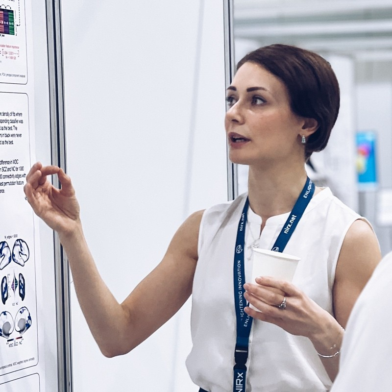

<header class="hero">
  <nav class="hero-nav">
    <ul>
      <li><a href="#about">ABOUT</a></li>
      <li><a href="#topics">TOPICS</a></li>
      <li><a href="#speakers">SPEAKERS</a></li>
      <li><a href="#program">PROGRAM</a></li>
      <li><a href="#organizers">ORGANIZERS</a></li>
    </ul>
  </nav>
  <h1>Foundation Models for Neuroimaging</h1>
  
Promises, pitfalls, and the imperative need for domain knowledge from cognitive and clinical neuroscience

  
Submitted at NeurIPS 2025

</header>

<section class="section" id="about">
  <h2>About</h2>
  

    Recent progress in foundation models has transformed many areas of machine learning,
    yet their application to brain data remains in its infancy. The complexity, diversity,
    and multimodal nature of neuroimaging present unique challenges and opportunities
    for building general-purpose models of the brain.
  

  

    This workshop brings together researchers from neuroscience, machine learning,
    and clinical disciplines to advance brain foundation models—large-scale, pre-trained models
    that learn meaningful representations of brain anatomy and function.
  

</section>

<section class="section" id="topics">
  <h2>Topics</h2>
  <ul>
    <li>Foundation models for structural, functional, and diffusion imaging</li>
    <li>Large-scale and multimodal neuroimaging datasets</li>
    <li>Biomarker discovery and model interpretability</li>
    <li>Brain decoding across modalities (fMRI, EEG, MEG)</li>
    <li>Multimodal representation learning and structure-function alignment</li>
  </ul>
</section>

<section class="section" id="speakers">
  <h2>Speakers</h2>
  <ul>
    <li>Russell Poldrack (Stanford University)</li>
    <li>Gaël Varoquaux (INRIA)</li>
    <li>Christos Davatzikos (University of Pennsylvania)</li>
    <li>Anqi Qiu (Hong Kong Polytechnic University)</li>
    <li>Jean-Rémi King / Charlotte Caucheteux / Hubert Banville (Meta)</li>
    <li>Paul Thompson (University of Southern California)</li>
  </ul>
</section>

<section class="section" id="program">
  <h2>Program Schedule</h2>
  
See the full schedule <a href="#">here</a>. The workshop will include invited talks, spotlight presentations, poster sessions, and a closing panel discussion.

</section>

<section class="section">
  <h2>Call for Papers</h2>
  
We welcome submissions on all topics related to large-scale modeling and brain representation learning. Details and submission links coming soon.

</section>

<section class="section">
  <h2>Diversity and Inclusion</h2>
  

    We actively encourage participation from underrepresented groups in AI and neuroscience.
    We aim to create an inclusive and collaborative environment for all attendees.
  

</section>

<section class="section" id="organizers">
  <h2>Organizers</h2>
  

    

      
      <h3>Carlo Alberto Barbano</h3>
      
University of Turin

    

    

      
      <h3>Benoit Dufumier</h3>
      
NeuroSpin, CEA

    

    

      
      <h3>Victoria Shevchenko</h3>
      
INRIA Saclay, Université Paris Cité

    

    

      
      <h3>Demian Wassermann</h3>
      
INRIA Saclay

    

  

</section>

